# Chat-Application
## Abstract
Raw CLI chatting application for C language socket API practice.

## Envirment
### OS & Kernel

### GCC 

### GNU Make

## Build
### make
* Change directory to root `(Chat-Application directory)`
* Just type `make`

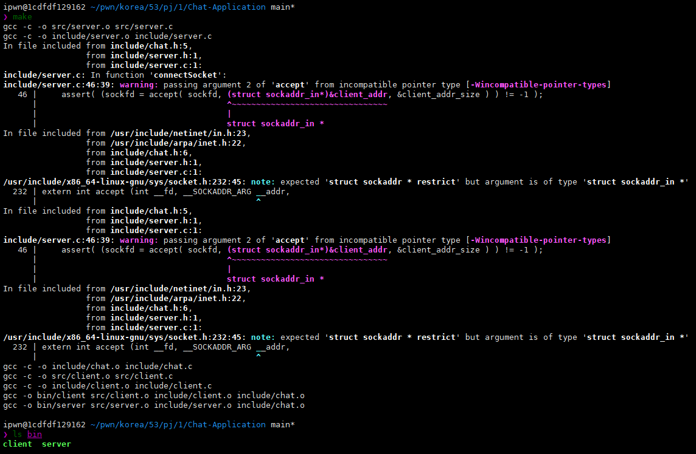

### remove (make clean)
* Change directory to root `(Chat-Application directory)`
* Just type `make clean`

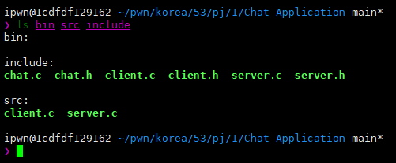

## Explain the details
### File structure
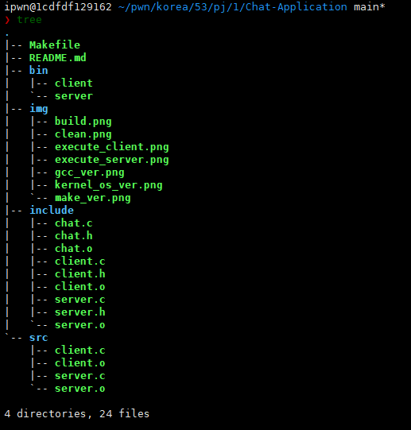
### Chat source
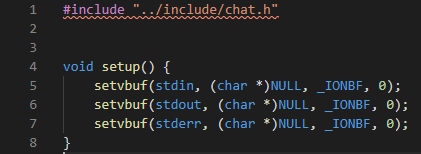
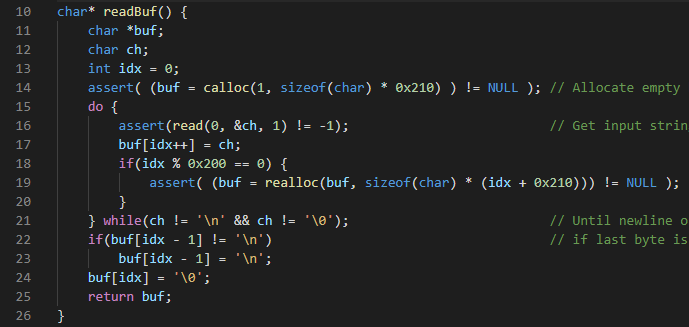
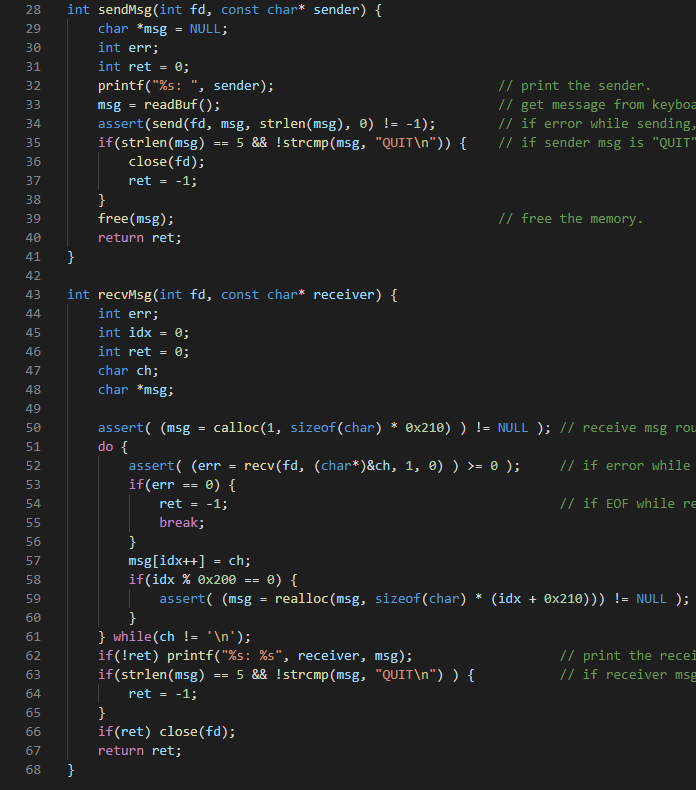
### Server source
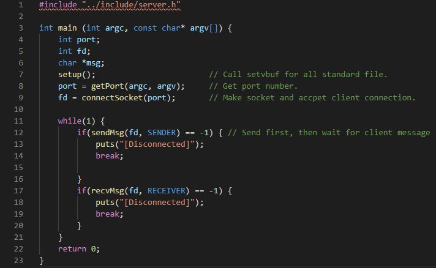
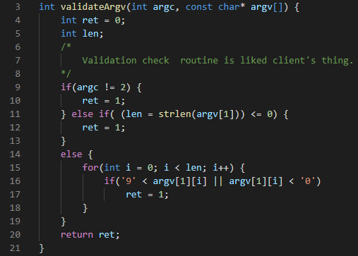

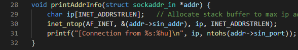
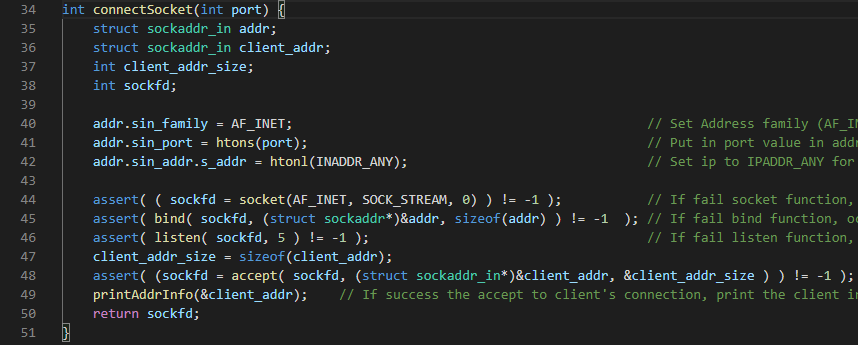
### Client source
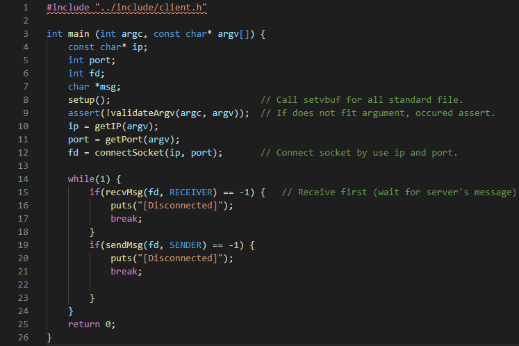
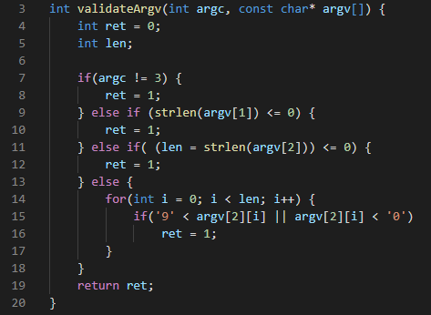
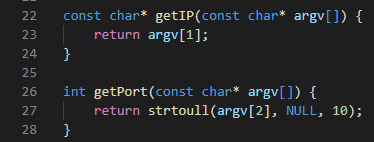

## Execution
### Screenshot dump
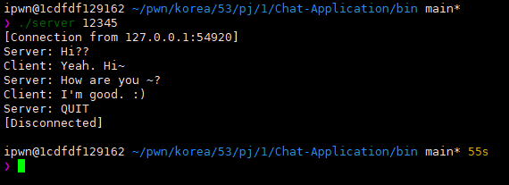
