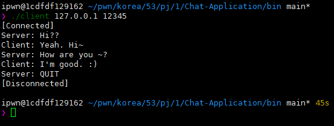

# Chat-Application
## Abstract
Raw CLI chatting application for C language socket API practice.

## Envirment
### OS & Kernel

### GCC 

### GNU Make

## Build
### make
* Change directory to root `(Chat-Application directory)`
* Just type `make`

### remove (make clean)
* Change directory to root `(Chat-Application directory)`
* Just type `make clean`

## Explain the details
### File structure

### Chat source

### Server source

### Client source

## Execution
### Screenshot dump

