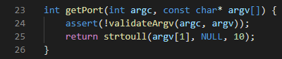
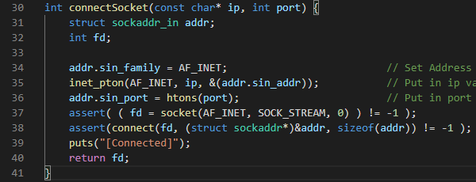

# Chat-Application
## Abstract
Raw CLI chatting application for C language socket API practice.

## Envirment
### OS & Kernel

### GCC 

### GNU Make

## Build
### make
* Change directory to root `(Chat-Application directory)`
* Just type `make`

### remove (make clean)
* Change directory to root `(Chat-Application directory)`
* Just type `make clean`

## Explain the details
### File structure

* `bin`: executable binary.
* `img`: report images.
* `include`: header and backend function source file. (After build, then object file exist too.)
* `src`: main(frontend) source file. (After build, then object file exist too.)
### Chat source
#### setup()

File stream clean up.

#### readBuf()

Get the input message string.
무한정 입력을 받기 위해, 1byte씩 입력을 받다가 일정 크기 이상의 입력을 받게되었다면 공간을 재할당하고 입력을 계속 받는다.
개행이나 NULL byte가 입력될 때까지 반복하고, 무조건 문자열의 마지막이 `'\n\0'`이 되도록 구성한다. 

#### sendMsg() & recvMsg()

`sendMsg`
`send`라는 TCP/IP 통신 API를 통해 입력받은 `msg`를 전송한다.
입력받은 `msg`가 정확히 `QUIT`일 경우에는 소켓 연결을 `close` API를 통해 종료한다.
이 과정에서 실제로 TCP/IP 통신의 연결을 끊는다.

`recvMsg`
`recv`라는 TCP/IP 통신 API를 통해 `msg`를 전송받는다.
이 과정에서 받는 `msg`의 크기 제한이 없도록 `readBuf`의 루틴을 참조한다.
만일 입력받는 중 `EOF`가 발생할 경우 소켓 연결이 종료된 것이므로, socket을 close하고 프로그램을 종료한다.
그 이후 받은 `msg`를 출력한다.
이 때 받은 `msg`가 정확히 `QUIT`일 경우 소켓 연결을 close하고 프로그램을 종료한다.

### Server source
모든 소스에서 에러에 강력하게 대응하여 assertion을 발생시킨다.
#### main

구현된 함수들(이하 설명)을 통해 구현됐다.
인자를 통해 열 port를 받아오고 그를 통해 소켓을 형성 및 연결을 받는다.

그 이후는 무한루프를 통해 입력, 출력을 반복한다. (선 입력 후 출력)
#### validateArgv

argc가 2가 아닐 경우, 입력받은 인자가 숫자가 아닐 경우 잘못된 인자로 판단한다.

#### getter

getPort함수는 인자의 유효성을 검사한 후, 입력받은 인자를 숫자로 변환하여 반환한다.

#### printAddrInfo

connectSocket 내부에서 호출되는 함수인데, 인자로 넘겨받은 addr의 값을 visible하게 출력한다.
`inet_ntop` API를 통해 구조체 내부의 IP값을 string으로 변환하여 저장하고, printf로 출력한다.
이 때, port값을 `ntohs` API를 통해 `big endian` -> `little endian`으로 변환한다.

#### connectSocket

socket을 생성하는데, address family로 설정하고(사실 내부적으로 PF와 AF는 같다.) `htonl, htons`를 통해 endian을 `little -> big`으로 변환한다.
그 이후 `bind -> listen -> accept` 과정을 통해 client의 연결을 대기하고, 연결됐을 경우 정보를 출력한 뒤 descriptor를 반환한다.
### Client source
#### main

standard file stream을 정리하고, 인자를 통해 ip, port를 get한 뒤 서버에 연결을 시도한다.
연결에 성공할 경우 출력과 입력을 반복한다. (선 출력 후 입력)
#### validateArgv

서버의 루틴과 같은데, IP의 유효성 (입력이 되었는지)를 추가적으로 검증한다.
#### getter

port와 IP를 각각 반환한다.
#### connectSock

입력받은 IP와 port를 통해 socket structure를 구성한다.
`inet_pton` API를 통해 IP string을 구조체 안에 삽입한다.
이후에는 단순히 형성된 socket 정보를 통해 connect를 시도하고, socket descriptor를 반환한다.
## Execution
### Screenshot dump
#### Server

connection이 성공할 경우, (3-way handshake) 클라이언트의 정보를 출력하고 대화를 시도한다.
`QUIT`를 입력하자 종료되는 것을 확인할 수 있다.
이 때도 TCP/IP의 종료 과정을 따른다.
#### Client

connection이 성공할 경우, (3-way handshake) connection의 성공을 알린다.
이후 `QUIT`를 전송받자 소켓 연결이 종료됨을 확인할 수 있다.
이 때도 TCP/IP의 종료 과정을 따른다.